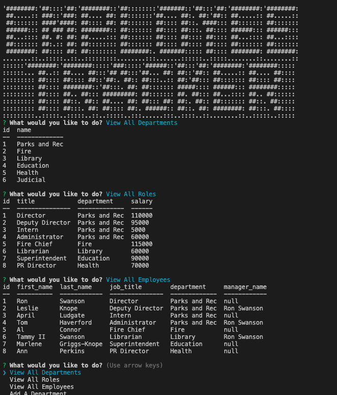

# Employee Tracker

## Table of Contents

- [Description](#📝-description)
    - [User Story](#👤-user-story)
    - [Acceptance Criteria](#☑️-acceptance-criteria)
- [Technologies Used](#🛠️-technologies-used)
- [Usage](#💻-usage)
    - [Screenshot](#📸-screenshot)
- [License](#📃-license)
- [Links](#🔗-links)

------------

## 📝 Description

For this module we were tasked with creating a command-line application that can manage a company's employee database, from scratch with Node.js, inquirer, and MySQL.

-------------

### 👤 User Story

```md
AS A business owner
I WANT to be able to view and manage the departments, roles, and employees in my company
SO THAT I can organize and plan my business
```
-------------
### ☑️ Acceptance Criteria

```md
GIVEN a command-line application that accepts user input
WHEN I start the application
THEN I am presented with the following options: view all departments, view all roles, view all employees, add a department, add a role, add an employee, and update an employee role
WHEN I choose to view all departments
THEN I am presented with a formatted table showing department names and department ids
WHEN I choose to view all roles
THEN I am presented with the job title, role id, the department that role belongs to, and the salary for that role
WHEN I choose to view all employees
THEN I am presented with a formatted table showing employee data, including employee ids, first names, last names, job titles, departments, salaries, and managers that the employees report to
WHEN I choose to add a department
THEN I am prompted to enter the name of the department and that department is added to the database
WHEN I choose to add a role
THEN I am prompted to enter the name, salary, and department for the role and that role is added to the database
WHEN I choose to add an employee
THEN I am prompted to enter the employee’s first name, last name, role, and manager, and that employee is added to the database
WHEN I choose to update an employee role
THEN I am prompted to select an employee to update and their new role and this information is updated in the database 
```
--------------

## 🛠️ Technologies Used

<ul>
<li>JavaScript
<li>Node
<li>Inquirer
<li>mySQL
</ul>

--------------
## 💻 Usage

**Steps for Usage**  
***1:*** open the terminal  
***2:*** run  `npm i` to install necessary packages included in the `package.json`   
***3:*** run `mysql -u root -p` to start mysql  
***4:*** run `node index` to start the application   
***5:*** follow prompts  
***6:*** to quit the application select 'quit' option when asked what you would like to do


**Video Walkthrough:** https://drive.google.com/file/d/1XbQsUEvUPcb2I1yl34QdqK_ROIjGhuHa/view?usp=sharing

----------------
### 📸 Screenshot



--------------

## 📃 License

Please refer to the LICENSE in the repo.

-------------

## 🔗 Links

inquirer Docs: https://www.npmjs.com/package/inquirer/v/8.2.4

mysql2 Docs: https://www.npmjs.com/package/mysql2